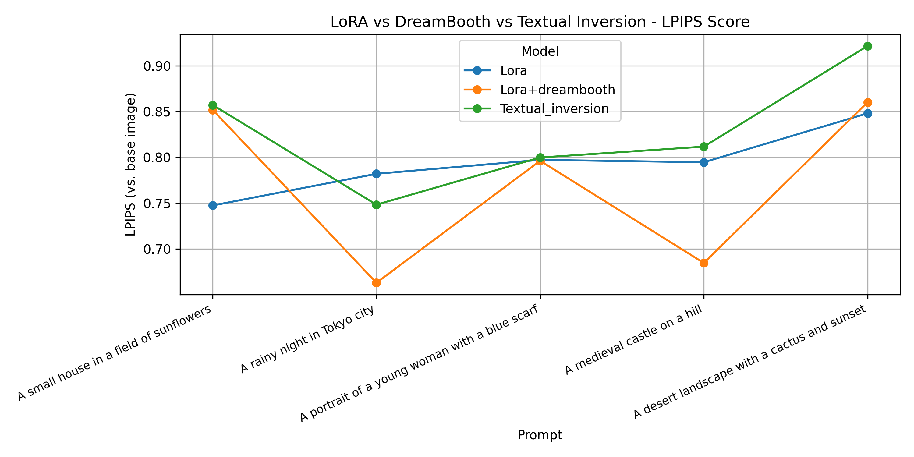

# fine_tuning 微调 + 模型比较项目
本项目基于Stable Diffusion v1.5，使用lora微调方法，训练3种艺术风格（以monet为代表的印象派，以van-gogh为代表的后印象派，以francis为代表的抽象表现派），并接入AI创意图像生成平台。此外，还使用动漫化人物数据集，对lora、lora+dreambooth、textual_inversion微调结果分析对比。

## 项目结构
```
fine_tuning/
├── diffusers-main/              # 下载到本地的 diffusers 库
├── model_compare/               # 模型比较脚本、指标等
|   ├── monet_lora/
│   └── van_gogh_lora/
├── models/ 
│   ├── stable-diffusion-v1-5/
├── outputs/                              # 微调模型权重
│   ├── lora_anime/                       
│   │   └── pytorch_lora_weights.safetensors
│   ├── lora_dreambooth_anime/          
│   │   └── pytorch_lora_weights.safetensors
│   ├── lora_francis/                   
│   │   └── pytorch_lora_weights.safetensors
│   ├── lora_monet/                    
│   │   └── pytorch_lora_weights.safetensors
│   ├── lora_vangogh/                   
│   │   └── pytorch_lora_weights.safetensors
│   └── textual_inversion_anime/        
│       ├── learned_embeds.safetensors
│       └── learned_embeds-steps-500.safetensors
├── scripts/                     # 启动训练的 shell 脚本
│   ├── train_textual_inversion.sh
│   └── train_vangogh_ti.sh
├── training/                    # 微调训练 Python 脚本
│   ├── train_dreambooth_lora.py
│   └── textual_inversion.py
├── trainsets/                   # 训练图像数据集
│   ├── anime-style/
│   └── van_gogh/
├── venv/                        # 虚拟环境（参考环境配置说明）
├── requirements.txt             # 依赖列表
└── README.md                    # 项目说明
```

## 环境配置
### 克隆仓库并进入项目
```bash
git clone https://github.com/ddsfda99/fine_tuning.git
cd fine_tuning
```
### 配置 Python 虚拟环境 + 安装依赖
```bash
python3 -m venv venv           
source venv/bin/activate      
pip install -r requirements.txt 
```
### 下载stable-diffusion-v1.5
下载链接：https://modelscope.cn/models/AI-ModelScope/stable-diffusion-v1-5

下载完之后放入本项目中models/stable-diffusion-v1-5/
### 下载最新版diffusers源码安装
下载链接：https://github.com/huggingface/diffusers

下载完之后放入本项目中diffusers-main/ 

##  微调方法及模型比较
### LoRA微调3种风格（以monet为代表的印象派，以van-gogh为代表的后印象派，以francis为代表的抽象表现派）
在fine_tuning根目录下运行训练示例（训练monet风格）：
```
chmod +x ./scripts/monet/train_lora_monet.sh
./scripts/monet/train_lora_monet.sh
```
### 3种艺术风格配置与效果
### 微调配置
| 风格流派           | 数据集大小  | Prompt Token | 图像分辨率   | 训练步数 | 精度设置 | 启动命令              |
| -------------- | ------ | ----------------- |  ------- | ---- | ---- | ----------------- |
| 印象派（Monet）     | 1365 张 | `<monet-style>`| 512×512 | 200  | fp16 | accelerate launch |
| 后印象派（Van Gogh） | 1929 张 | `<vangogh-style>`| 512×512 | 200  | fp16 | accelerate launch |
| 抽象表现派（Francis） | 370 张  | `<francis-style>`| 512×512 | 200  | fp16 | accelerate launch |

### 训练结果
| 风格流派     | 最终损失（loss） | 每步平均耗时  | 总训练时长      |
| -------- | ---------- | ------- | ---------- |
| Monet    | 0.273      | 约 0.5 秒 | 约 1 分 30 秒 |
| Van Gogh | 0.115      | 约 0.5 秒 | 约 1 分 30 秒 |
| Francis  | 0.234      | 约 0.5 秒 | 约 1 分 30 秒 |

### 3种微调方式对比
| 方法                | 可训练参数            | 修改位置                     | 适用场景                         | 优势                         | 劣势                           |
|---------------------|------------------------|------------------------------|----------------------------------|------------------------------|--------------------------------|
| LoRA            | 低秩矩阵    | 注意力层     | 微调风格、任务迁移              | 参数少，训练快，易组合       | 无法引入新概念      |
| LoRA + DreamBooth | Adapter + Embedding    | 注意力层 + 嵌入层             | 个性化定制（如人物、宠物）      | 可同时捕捉风格与概念         | 训练较慢，显存消耗相对较高     |
| Textual Inversion | 新Token的Embedding     | 仅嵌入层                      | 新概念注入（如特定物品、风格）  | 参数极少，可跨任务通用       | 精度有限，不易表达复杂风格     |

#### lpips对比图


### 项目资料
AI图像生成项目录屏演示：AI图像生成项目录屏演示：https://www.bilibili.com/video/BV1tfNszmEpp/?vd_source=de633d4318be770bdffc3275f1e20c2c

或者在https://github.com/ddsfda99/ai-image/blob/main/%E9%A1%B9%E7%9B%AE%E6%BC%94%E7%A4%BA.mp4 下载观看

项目展示ppt链接：https://github.com/ddsfda99/ai-image/blob/main/AI%E5%88%9B%E6%84%8F%E5%9B%BE%E5%83%8F%E7%94%9F%E6%88%90%E9%A1%B9%E7%9B%AEppt%E5%B1%95%E7%A4%BA.pptx

AI图像生成项目地址：https://github.com/ddsfda99/ai-image

微调训练+模型比较分析项目地址：https://github.com/ddsfda99/fine_tuning/tree/main

